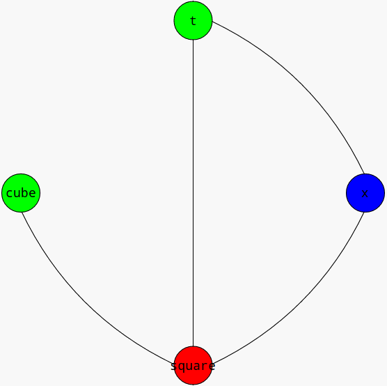

Title: Data Flow Analysis
Date: 02.02.2014
Category: Data Flow Analysis
Tags: pelican, publishing
Author: Nandor Licker
Summary: Summary of Data Flow Analysis

Live Variable Analysis
======================

Live Variable Analysis is used to determine which variables defined at a certain point in a program are going to be used later on. This type of analysis can be used to eliminate assigments to variables whose values are not
read or are overwritten. The results can also be used to minimize storage by reassigning the same registers/memory locations to variables which are not live at the same point.

In the case of live variable analysis, the kill function returns the set of variables which are overwritten by a statement and the gen function returns the set of variables which are used in a statement.

For example, for the following function written in mini:

    func smoothstep(t) {
      y = 0;                  // 0
      x = t ^ 2;              // 1
      square = 3 * x;         // 2
      cube = 2 * x * t;       // 3
      return square - cube;   // 4
    }

The kill and gen function would be defined as follows:

|   | kill    | gen          |
| - | ------- | ------------ |
| 0 | y       |              |
| 1 | x       | t            |
| 2 | square  | x            |
| 3 | cube    | x, t         |
| 4 |         | square, cube |

By solving the set of equations using chaotic iteration we get:

|   | liveIn          | liveOut      |
| - | --------------- | ------------ |
| 0 |                 |              |
| 1 | t               | x, t         |
| 2 | x, t            | square, x, t |
| 3 | square, x, t    | square, cube |
| 4 | square, cube    |              |

Assignment of variables to registers/memory locations
=====================================================

If two variables are live at the same point in 2a program, they need to be allocated to different registers or they need different locations in memory. Allocation can be optimised by building an *interference graph* from the results of the analysis where nodes represent variables and the edges are placed between the variables which cannot be allocated to the same location. To determine the optimal allocation, the *minimal coloring of the graph* has to be determined. Unfortunaly, this problem has been proven to be NP-Complete. Assuming P does not equal NP, there is no feasible solution to compute an optimal assignment in reasonable time. Fortunately, there are some heuristic algorithms which can provide a good distribution. In the simulation, we have implemented the *Welsh-Powell* algorithm.

References
==========

1. Nielson, Flemming, Hanne R. Nielson, and Chris Hankin. Principles of program analysis. Springer, 1999.
2. Karp, Richard M. Reducibility among combinatorial problems. Springer US, 1972.
3. Welsh, D. J., & Powell, M. B. (1967). An upper bound for the chromatic number of a graph and its application to timetabling problems. The Computer Journal, 10(1), 85-86.
4. Brélaz, D. (1979). New methods to color the vertices of a graph. Communications of the ACM, 22(4), 251-256.